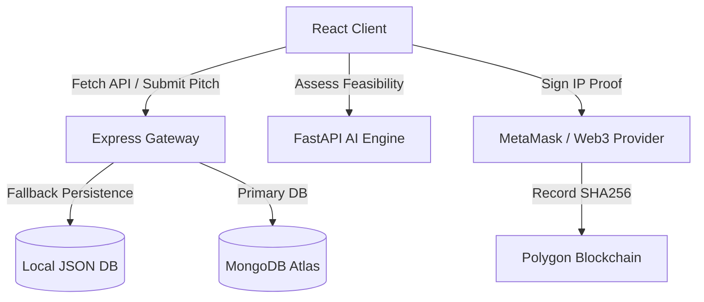

<p align="center">
  <a href="https://github.com/Manvikamboz/Startora">
    
  </a>
</p>

# Startora

> The open-source platform for student founders.

We're building Startora, an open-source startup operating system for students. Think GitHub meets LinkedIn meets Y Combinator—designed specifically to help student founders discover teammates, validate ideas, and build venture-scale startups before they leave university.

---

## Why Startora?

- **Zero-Friction Co-founding:** Connect with other university builders across different disciplines and institutions.
- **Cryptographic IP Protection:** Pitch and validate your ideas without the fear of theft by securing SHA-256 fingerprint proofs on-chain.
- **Instant AI Feedback:** Evaluate the market viability, competitor landscape, and technical feasibility of your pitches in seconds.
- **Democratic Incubation:** Pitch startup ideas directly to the community and let users co-develop or back your venture via DAO voting consensus.

---

## Features

- **FastAPI AI Microservice:** Implements intelligent NLP-based cosine similarity algorithms and automated business plan feasibility metrics to evaluate startup viability.
- **Polygon Smart Contract Registry:** Cryptographically seals ideas by posting SHA-256 fingerprints on-chain for secure, decentralized ownership verification.
- **DAO Consensus Voting:** A token-weighted consensus sandbox where community upgrades and features are proposed and voted on democratically.
- **3D Interactive Ecosystem Menu:** A hardware-accelerated WebGL rotating sphere using a **Fibonacci Sphere Distribution Algorithm** to display **30 completely unique startup categories** (with high-quality photography and dynamic scaling) mapping 1-to-1 to custom orbital nodes.
- **Direct System Architecture:** Interactive, glassmorphic system diagrams immediately visible on the platform to map developer flows, database synchronizations, and server connections.
- **Interactive Developer Sandbox:** Live-streamed repository logs and a custom Git-like console shell to simulate development workflows in real-time.

---

## Technology Stack

- **Frontend:** React, Vite, Framer Motion (`motion/react`), GL-Matrix, GSAP (GreenSock), Lucide React
- **Styling:** Custom glassmorphic CSS tokens and responsive breakpoint layout engines
- **3D Visuals:** WebGL 2.0 (Custom shaders, icosahedron subdivisions)
- **Backend Services:** Node.js/Express (Router layer), FastAPI (AI recommendation engine)
- **Database:** MongoDB Atlas cluster with structured failover fallback
- **Smart Contracts:** Solidity, Hardhat sandbox local testing networks

---

## Architecture



---

## Getting Started

### Prerequisites

Ensure you have [Node.js](https://nodejs.org/) (v16+) and `npm` installed.

### Installation

1. Clone the repository:
   ```bash
   git clone https://github.com/Manvikamboz/Startora.git
   cd Startora
   ```

2. Install the dependencies:
   ```bash
   npm install
   ```

3. Run the development server locally:
   ```bash
   npm run dev
   ```

4. Build the application for production:
   ```bash
   npm run build
   ```

---

## Roadmap

- [x] **Phase 1: Foundation** — Setup WebGL 3D interface, responsive glassmorphic design system, and Express server fallback databases.
- [x] **Phase 2: Incubation Core** — Build Category Exploration modals and Community Q&A modules.
- [ ] **Phase 3: Smart Contract Deployments** — Integrate MetaMask wallet connection and deploy Polygon IP registry smart contracts.
- [ ] **Phase 4: AI Recommendations** — Connect the FastAPI recommendation engine to compute real-time feasibility metrics.

---

## Contributing

Startora is built for the open-source future. Every feature added to our repository is decided democratically via token-weighted consensus voting. 

1. Fork the project.
2. Create your Feature Branch (`git checkout -b feature/AmazingFeature`).
3. Commit your changes (`git commit -m 'Add some AmazingFeature'`).
4. Push to the branch (`git push origin feature/AmazingFeature`).
5. Open a Pull Request.

---

## Community

<a href="https://discord.gg/WsUCXPxnZ">
  
</a>

💬 **[Click here to join the Startora Discord Community!](https://discord.gg/WsUCXPxnZ)**

---

## License

This project is licensed under the MIT License - see the [LICENSE](LICENSE) file for details.
