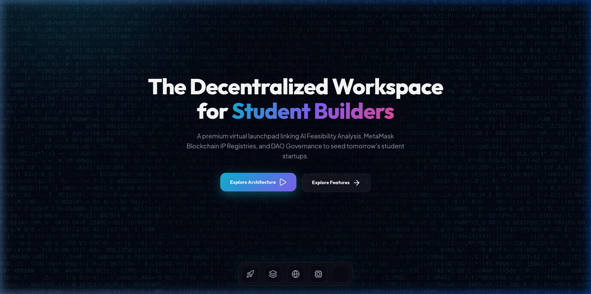
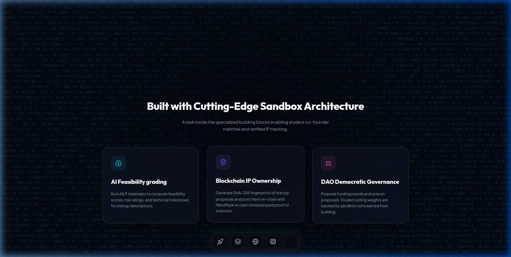
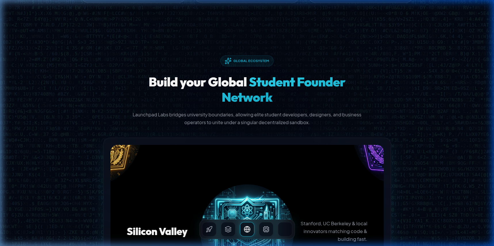
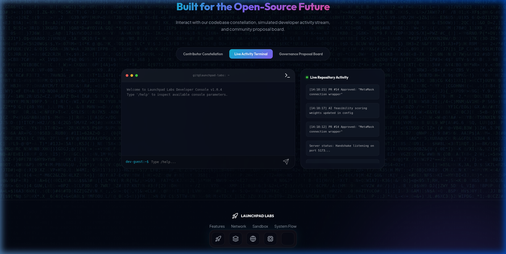

<p align="center">
  <a href="https://github.com/Manvikamboz/Startora">
    
  </a>
</p>

<h1 align="center">Startora</h1>

<p align="center">
  <strong>The open-source platform for student founders.</strong>
</p>

We're building Startora, an open-source startup operating system for students. Think GitHub meets LinkedIn meets Y Combinator—designed specifically to help student founders discover teammates, validate ideas, and build venture-scale startups before they leave university.

---

## 📸 Screenshots

| Hero & Landing Page | Features Bento Grid |
| :---: | :---: |
|  |  |

| Global Ecosystem | Developer Activity Terminal |
| :---: | :---: |
|  |  |

---

## ❓ Why Startora?

Starting a venture in university is notoriously fragmented. Student founders face three key challenges:
- **Teammate Discovery:** Finding cross-disciplinary builders (engineers, designers, operators) on campus.
- **Idea Validation:** Evaluating pitch viability and feasibility without expensive market research.
- **IP Protection:** Securing ownership of project ideas before legal incorporation.

Startora integrates AI feedback, smart contract IP signing, and token-weighted DAO governance into a unified, open-source dashboard. We're giving student builders the tools they need to launch venture-scale companies directly from their dorm rooms.

---

## ✨ Features

- **FastAPI AI Microservice:** Implements NLP-based cosine similarity algorithms and automated business plan feasibility metrics to evaluate startup viability.
- **Polygon Smart Contract Registry:** Cryptographically seals ideas by posting SHA-256 fingerprints on-chain for secure, decentralized ownership verification.
- **DAO Consensus Voting:** A token-weighted consensus sandbox where community upgrades and features are proposed and voted on democratically.
- **3D Interactive Ecosystem Menu:** A hardware-accelerated WebGL rotating sphere using a **Fibonacci Sphere Distribution Algorithm** to display **30 completely unique startup categories** with dynamic orbital nodes.
- **System Architecture Diagrams:** Interactive, glassmorphic system diagrams immediately visible on the platform to map developer flows and database synchronizations.
- **Interactive Developer Sandbox:** Live-streamed repository logs and a custom Git-like console shell to simulate development workflows.

---

## 🛠️ Technology Stack

- **Frontend:** React, Vite, Framer Motion (`motion/react`), GL-Matrix, GSAP (GreenSock), Lucide React
- **Styling:** Custom glassmorphic CSS tokens and responsive breakpoint layout engines
- **3D Visuals:** WebGL 2.0 (Custom shaders, icosahedron subdivisions)
- **Backend Services:** FastAPI (AI recommendation engine) & Node.js/Express (Coordination layers)
- **Database:** MongoDB Atlas cluster with structured failover fallback
- **Smart Contracts:** Solidity, Hardhat sandbox local testing networks

---

## 📐 Architecture

Startora follows a modular 3-tier architecture:
- **Presentation Layer (Frontend):** React + Vite SPA using WebGL and Framer Motion for high-fidelity animations, and Web3 connection layers (MetaMask).
- **Application Layer (Backend):** 
  - **Express Server:** Handles coordinates, suggestions registry, Q&A records, and serves as a coordination proxy.
  - **FastAPI Engine:** Serves ML model recommendations, parsing categories, and evaluating pitches.
- **Data & Smart Contract Layer:** MongoDB Atlas (primary storage) + Local JSON fallbacks (persistence), and Ethereum-compatible Polygon smart contracts for immutable IP registry.

---

## 🚀 Getting Started

### Prerequisites

Ensure you have [Node.js](https://nodejs.org/) (v16+) and `npm` installed.

### Installation

1. Clone the repository:
   ```bash
   git clone https://github.com/Manvikamboz/Startora.git
   cd Startora
   ```

2. Install the dependencies:
   ```bash
   npm install
   ```

3. Run the development server locally:
   ```bash
   npm run dev
   ```

4. Build the application for production:
   ```bash
   npm run build
   ```

---

## 🗺️ Roadmap

- [x] **Phase 1: High-Fidelity UI & Sandbox Interactive Console**
- [x] **Phase 2: Category Explore & Live Q&A Integration**
- [ ] **Phase 3: Polygon Smart Contract & MetaMask Wallet Integrations**
- [ ] **Phase 4: Multi-University Node Network & Token Airdrops**

---

## 🤝 Contributing

Startora is built for the open-source future. Every feature added to our repository is decided democratically via token-weighted consensus voting. 

1. Fork the project.
2. Create your Feature Branch (`git checkout -b feature/AmazingFeature`).
3. Commit your changes (`git commit -m 'Add some AmazingFeature'`).
4. Push to the branch (`git push origin feature/AmazingFeature`).
5. Open a Pull Request.

---

## 💬 Community

<a href="https://discord.gg/WsUCXPxnZ">
  
</a>

**[Click here to join the Startora Discord Community!](https://discord.gg/WsUCXPxnZ)**

---

## 📄 License

Distributed under the MIT License. See `LICENSE` for more information.
